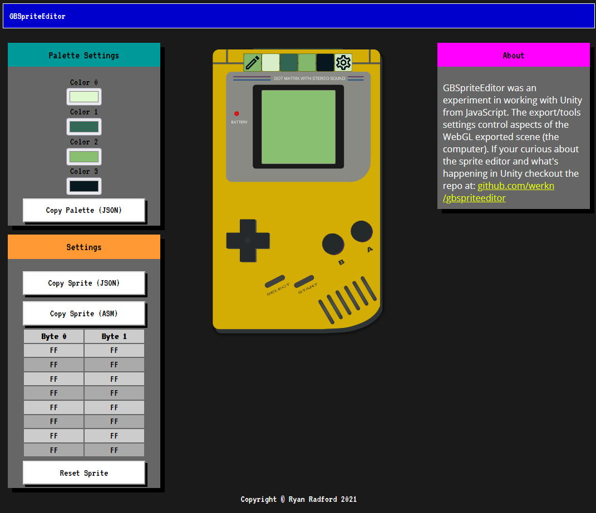

# GBSpriteEditor
GBSpriteEditor was an experiment in working with Unity from JavaScript. The export/tools settings control aspects of the WebGL exported scene using JavaScript interop with exported Unity code. 

The tool can be used to make graphics for the GameBoy DMG and exports to both JSON and GZ80 Assembly (if your using a tool like RGBDS).  It's not meant for editing all of your graphics but as a tool to learn the 2BPP (2 Bits Per Pixel) graphic format which can be a bit tricky to wrap your head around at first.  It pairs well with my tutorial on [setting up a GameBoy Development Kit]().

# Live Demo

[https://werkn.github.io/GBSpriteEditor/](https://werkn.github.io/GBSpriteEditor/)

# Preview

